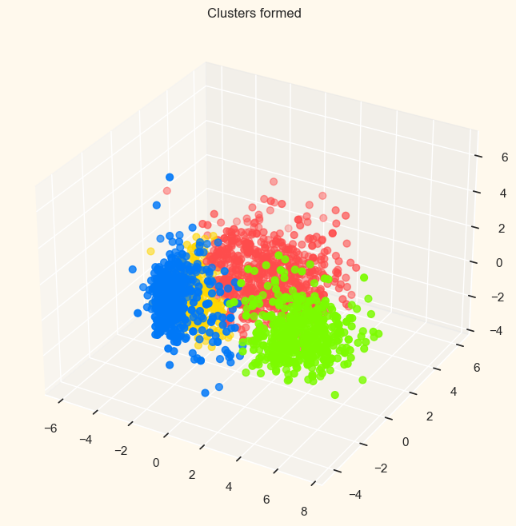

# Customer-Personality-Segmentation
Unsupervised clustering of customer records from a groceries firm's database. Customers are commonly divided into segments to tailor products according to distinct needs and behaviors.

## Clustering by Agglomerative algorithm

## Clustering by Hand-built K-means
